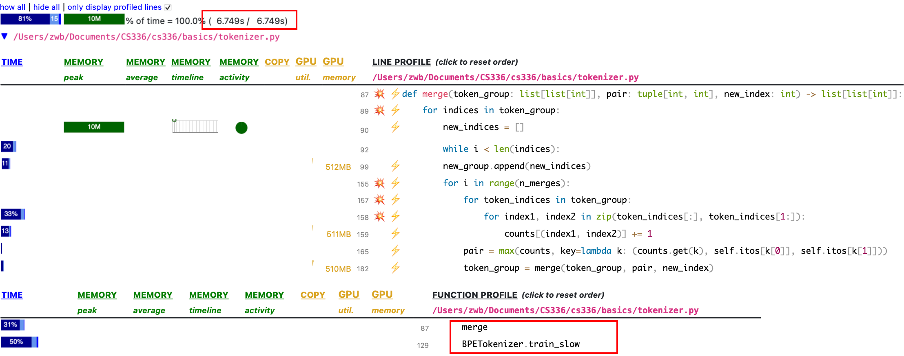
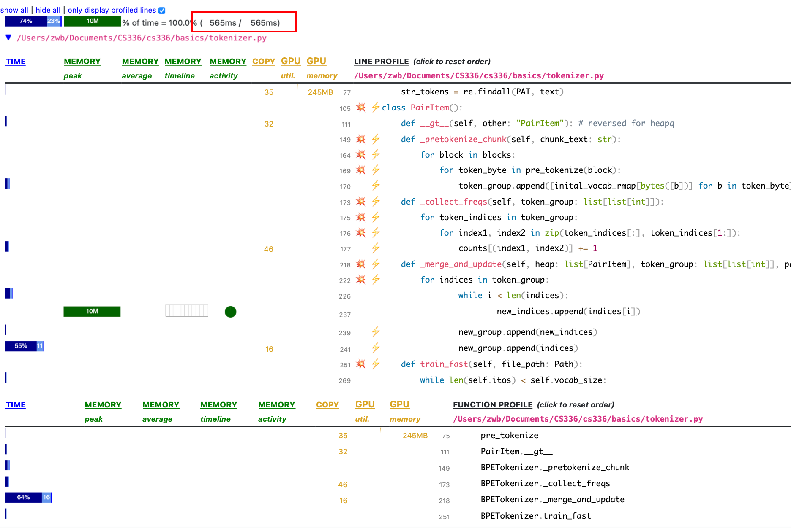
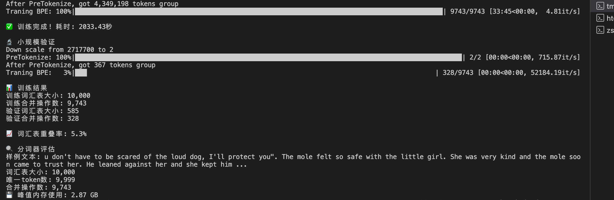

# Assignment 1 (Basics)
- 课程目标：构建训练一个标准Transformer LM的所有组建, 包括：
    - BPE(Byte-pair encoding) tokenizer
    - Transformer language model
    - The cross-entropy loss function & AdamW optimizer
    - The training loop, with support for serializing and loading model and optimizer state

- 实现限制：不允许使用 `torch.nn, torch.nn.functional, torch.optim`, 除了：
    - `torch.nn.Parameter`
    - `torch.nn` 中的容器类 (如 `Module, ModuleList, Sequential, ...`)
    - `torch.optim.Optimizer` 基类

## BPE Tokenizer
- 将任意的Unicode字符串表示为一串bytes来训练tokenizer
- Unicode 标准将字符映射成code points, 其vocabulary非常大(约150K)且稀疏 (character-level), 训练起来效率低; 先讲字符转成用utf-8编码的字节序列 (byte-level), 可以将vocabulary压缩到 256 起步, 后面再根据BPE的规则拼接出常用的字节对, 省空间, 大大降低了稀疏的问题.
- word-level 的 tokenizer 会遇到 out-of-vocabulary 的情况 (遇到训练时没遇过的 token), 而 character-level/byte-level 会导致输入的文本被编码成很长的序列, 会带来更多的计算和数据的更长期的依赖. 一种中间选择是 subword tokernizer, 用更大的 vocabulary size 换取更好的压缩, 比如 b'the' 出现的频率很高, 就为 b'the' 分配新的 vocab-id 来单独代表这个token. BPE encoding 就是一种选择 subword 的算法.
- BPE Tokenizer 的训练包括三个步骤:
    - **Vocabulary initialization**: 建立256个bytes和vocab-id的映射
    - **Pre-tokenization**: 遍历一遍训练语料来对相邻bytes做合并以及统计频次开销太大, 并且会将语义相近的token切分成无关的token(如 "dog." 和 "dog!"). 可以通过预先粗分一遍词(如 `line.split(" ")` 按 word 粗分), 然后再在这些词内部做合并, 节省算力又避免标点把近义词拆散. 文档里面给出一个更好的切分规则: `PAT = r"""'(?:[sdmt]|ll|ve|re)| ?\p{L}+| ?\p{N}+| ?[^\s\p{L}\p{N}]+|\s+(?!\S)|\s+"""`
    - **Compute BPE merges**: 反复找到频次最大的bytes-pair (A, B), 将他们合成新的 token AB 加入vocabulary; 不跨 pre-token 的边界进行合并; 频次相同时按选字典序最大的那对.
    - **Special tokens**: 有些特殊的字符串是用来表示元数据的, 比如 `<|endoftext|>`, 这些字符串应该只能用一个token来映射, 以此来标明什么时候结束生成(`<|endoftext|>`), 这些token的vocab-id应该是一个固定的值.
- 利用 TinyStories 数据集训练BPE Tokenizer:
    - **Parallelizing pre-tokenization**: 通过并行化对每个chunk做pre-tokenization, 加速处理速度, 每个chunk通过 special token进行分割, 利用lab提供的脚本`pretokenization_example.py`来处理. 处理后的chunks大致如: `[chunk1] abc..., [chunk2] <|endoftext|> cde..., [chunk2] <|endoftext|> fgh..., ...`
    - **Removing special tokens before pre-tokenization**: 由于一个chunk会包含多个docs，需要对每个chunk再通过 special token 进行切分.
        - 为什么用 `re.split` 不用 `str.split`: `str.split` 只支持单个special token, `re.split` 可以通过正则pattern支持多special token的切分
        - 为什么要用`re.escape(special_token)`: 因为special_token里面包括 `｜`, 如果直接使用，会被当成或的逻辑进行正则匹配
    - **Optimizing the merging step**: 之前每次合并, 都要遍历一遍所有pair计数, 但是其实只有合并的pair会产生新的pair需要计数, 没合并的pair不需要再算一次, 因此可以同增量更新计数来优化性能
- Encodeing 和 Decoding
    - 编码: BPE 对文本进行编码的过程就是我们训练的过程
        - **Pre-tokenization**
        - **Apply the merges**: 对于每个分词, 将其的字节序列按照训练阶段学到的合并规则列表逐步合并, **必须严格按照训练时产生的顺序依次尝试**: 每次查找当前序列中是否存在可应用的合并对, 存在则合并, 重复这个过程直到不存在可合并对. (不同分词之间不能合并, 注意 Special tokens)
        - **Map to token id**
    - 解码: 将 token ID 序列还原为原始文本, 注意一些非法的id, 可以在解码的时候让decode的参数errors='replace', 会自动替换不合法的ids
    


### Problem
- unicode1
    
    (a) `assert chr(0) == '\x00'`
    
    (b) `print()`调用的是`__str__()`, `repr()`调用的是`__repr__()`, 如果没实现 `__str__()`, `print()`调用`__repr__()`
    
    (c) `chr(0)` 在REPL里面直接输出表现为 `0x00`, 用 `print()` 则是空字符
- unicode2

    (a) utf-8可以将每个 ASCII 字符保留为单个字节, 而 utf-16, utf-32 会将每个 ASCII 字符编码成多个字节.
    ```python
    assert 'a'.encode('utf-8') == b'a'
    assert 'a'.encode('utf-16') == b'\xff\xfea\x00'
    assert 'a'.encode('utf-32') == b'\xff\xfe\x00\x00a\x00\x00\x00'
    ```

    (b) `decode_utf8_bytes_to_str_wrong` 只能 decode 字符的编码长度为1的情况, 大于1就会出错

    (c) 变种的Unicode中使用双字节的 `0xc0 0x80` 表示空字符, 在标准unicode中是非法的

- train_bpe:
    - 和下面的tokenizer实验可以放在一起实现, 为了节约时间, 参考了 https://zhuanlan.zhihu.com/p/1926723111111340178 的实现, 测试脚步顺序应该先测 test_train_bpe, 再测 test_train_bpe_speed, 先把功能正确实现了, 再考虑速度的问题.
    - bpe的基本逻辑就是参考讲义里面的实现, 但是需要做一些修改, 为了直观的对比自己写的代码的结果和测试的结果, 可以参考 tests/common, 实现 gpt2—str 和 unicode-bytes 互转的帮助函数, 然后把结果保存下来和答案做对比
    - 为了把功能实现正确, 需要注意的点:
        - 功能测试的测试集没有出现 special_token
        - 需要增加pre-tokenize的逻辑来划分groups, 然后再遍历每个groups来统计频次
        - 讲义里面求最大频次的pair没有考虑相同频次的情况, 需要增加相同频次按照字典序大小排序的逻辑(注意: 不是按照token-id排序)
        - 功能正确: test_train_bpe 和 test_train_bpe_special_tokens 都pass, test_train_bpe_special_tokens 大概要测十几分钟
    - 接下来需要优化性能, 通过profile工具来检查性能瓶颈:
        - python -m scalene ./basics/tokenizer.py -f ./tests/fixtures/corpus.en (scalene 不支持插桩)
        - 收集完会生成一个分析页面, 可以看到开销最大的代码片段
            
        - 分析可知代码在每次合并之后, 要全量统计所有pair的频次, 开销很大, 冗余计算太多了, 有些无关的pair根本不需要更新, 通过维护一个大根堆, 来增量更新pair的频次, 额外维护一个实时的pair_count, 当从堆中取出的pair的计数和pair_count中的不一致时, 说明其失效了, 更新其频次重新插入堆中, 通过perf可见性能提升了10x, test_train_bpe_special_tokens 测了1分钟多
        
        - 进一步优化pretokenize的性能, 启动多个进程来做, vocab_size=500, 优化前 43.3 s, 用 4 个进程预处理没发现性能提升, 可能是数据量太小, 只测pre-tokenize, 用TinyStoriesV2-GPT4-train.txt, 测试平台换成linux, 内存占用过大, 会导致机器卡死, 参考别人的实现: [Code](https://www.heywhale.com/api/notebooks/689709e123583639fc675b6f/RenderedContent?cellcomment=1&cellbookmark=1#🚀-执行流程详解), 这里的实现我主要参考的是他用mmap做测试集分割和采样的优化, merge的思路还是扫一遍groups, 我没太弄明白他的merge思路, 按照他的思路, 为每个pair维护其索引, 每次只需要遍历这部分索引的左右对即可, 但是合并会导致索引发生改变, 导致之前其他pair的索引失效, 这里不知道他是怎么处理的, 我按照他的逻辑实现的, 通过不了测试. 此外, 他的sample的逻辑, 会修改原本的训练数据, strip() 会删除 \n, ' ' 等, 导致测试三过不了, 去掉strip() 就可以了, 优化完, test_train_bpe_special_tokens 的性能从 1 分钟多 降低到 1分钟之内.
        - 设置采样参数 22000 个文本, vocab_size=10000, 在linux上大概要训练 33 min 
        
        

